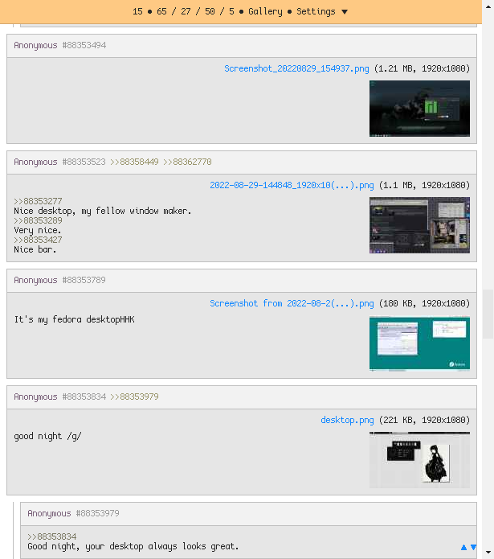
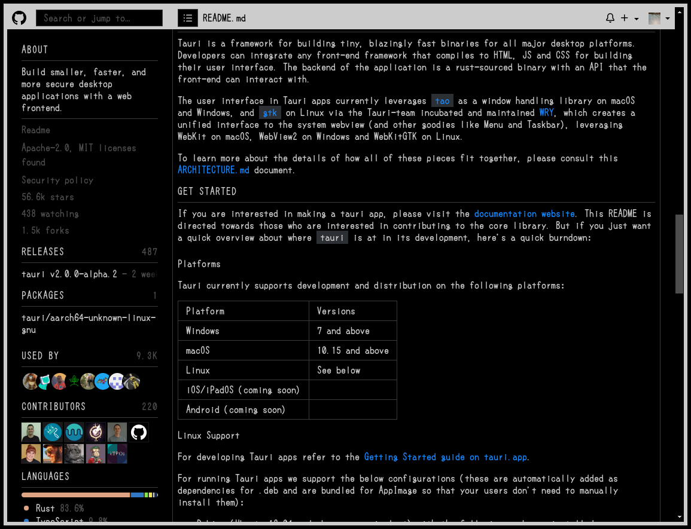

# userstyles
Personal userstyles with a specific customizable design that is made specifically with the goal of being simple and maintainable.

## Installation
None of them will work out of the box, as they all share variables from a single userstyle. You must first install (and then edit if you wish) [this userstyle](../../raw/master/_global.user.css).

If you wish to resize the sidebar(s) with a mouse, install [this userscript](../../raw/master/_global-resize-sidebar.user.js).

### Requirements
[4chan](../../raw/master/4chan.user.styl): [4chan X](https://www.4chan-x.net)

[Discord](../../raw/master/discord.user.styl): [class normalisation userscript](../../raw/master/discord-normalise-classes.user.js)

[GitHub](../../raw/master/github.user.styl), [SoundCloud](../../raw/master/soundcloud.user.styl): being logged in

[Reddit](../../raw/master/reddit.user.styl): put the following in uBlock Origin's "My filters":
```adb
! reddit
!! no subreddit css
||thumbs.redditmedia.com$stylesheet,domain=old.reddit.com
!! no sticky header
old.reddit.com##+js(set-constant.js, isPinned, true)
```

## Currently broken
- MDN

  Extensive use of shadow DOM after the (as of 2025-08-20) rewrite. May write a userscript, but will be dropped if it doesn't work.

- Unsplash

  They're starting to use CSS variables for colors, waiting until they finalize them & the new dark theme.

## Preview
They all share the same style, and it depends on how you edited the variables from the aforementioned userstyle.


